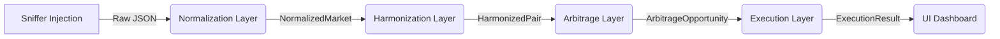

# System Architecture: Auto-Nav Arbitrage Engine

**Authoritative Technical Specification**
**Last Updated:** 2026-01-07
**Status:** PRODUCTION READY FOR TEST

---

## 1. System Objective & Scope Lock

The **Auto-Nav Arbitrage Engine** is a high-frequency sports betting arbitration system designed to identify and exploit price differentials between two specific betting providers ("Account A" and "Account B").

### Core Objectives
1.  **Automated Discovery**: Real-time sniffing of odds and balances via browser injection.
2.  **Deterministic Normalization**: Standardization of market data into a strict 4-type schema.
3.  **Latency-Free Harmonization**: Pairing of identical events across providers.
4.  **Safe Execution**: Sequential, state-guarded bet placement.
5.  **Visual Monitoring**: Real-time dashboard for "Glass-Box" system observability.

### Scope Constraints
-   **Markets**: STRICTLY `FT_HDP`, `HT_HDP`, `FT_OU`, `HT_OU` only. No 1X2. No Moneyline.
-   **Sports**: Soccer only.
-   **Execution**: Sequential (A then B, or B then A). No atomic/parallel execution.
-   **Accounts**: 1 Primary (A) + 1 Secondary (B).

---

## 2. End-to-End Pipeline

Data flows through a strictly sequential pipeline, ensuring data integrity at each stage.

1.  **Event Discovery**: `DiscoveryService` filters raw streams. Strict "Real Event" gate. Rejects non-events.
2.  **Normalization**: Transforms provider-specific strings into canonical formats.
3.  **Harmonization**: Matches events using fuzzy logic and rigorous market/period alignment.
4.  **Arbitrage**: Calculates implied probability and checks profit thresholds.
5.  **Execution**: Validates logic and executes bets via API.

---

## 3. Provider A/B Model

The system treats providers anonymously but distinct roles:

-   **Provider A (Primary)**:
    -   Role: Anchor price.
    -   Tech: `sniffer_A.js` / `betExecutorA.ts`.
    -   Gateway: WebSocket + REST.

-   **Provider B (Secondary)**:
    -   Role: Hedge price.
    -   Tech: `sniffer_B.js` / `betExecutorB.ts`.
    -   Gateway: WebSocket + REST.

**Endpoint Discovery**:
-   Automated by scraping active frames.
-   Dynamic status indicators (Green Dots 1-5) in UI.

---

## 4. Session & Login Architecture

-   **Browser-Based Session**: The system relies on an active browser session (Antigravity Browser).
-   **Token Hijacking**: Sniffers extract `auth_token` or `session_id` from legitimate traffic.
-   **Lifecycle**:
    -   User logs in manually.
    -   System detects "Connected".
    -   Sniffer routes traffic to `localhost:3001` via Socket.IO.
-   **Balance Sync**: Real-time balance scraping triggers UI updates.

---

## 5. Odds & Arbitrage Rules

### Market Whitelist
Only these specific market types are processed. All others are **DROPPED**.

| Code | Description | Normalization Rule |
| :--- | :--- | :--- |
| `FT_HDP` | Full Time Handicap | Home/Away, Float Line |
| `HT_HDP` | Half Time Handicap | Home/Away, Float Line |
| `FT_OU` | Full Time Over/Under | Over/Under, Float Line |
| `HT_OU` | Half Time Over/Under | Over/Under, Float Line |

### Arbitrage Formula
Opportunity exists if:
`Inverse_Odds_A + Inverse_Odds_B < 1.0`

**Profit Calculation**:
`Profit % = (1 - (1/OddsA + 1/OddsB)) * 100`

---

## 6. Execution Rules

To ensure fund safety and prevent "orphan bets" (one side placed, other failed):

1.  **Positive-Edge First**: Always place the bet with the value edge first (default Side A if equal).
2.  **Sequential Locking**:
    -   Step 1: Send Request A.
    -   Step 2: **WAIT** for `ACCEPTED` / `SUCCESS` response.
    -   Step 3: IF Success -> Send Request B.
    -   Step 4: IF Fail -> **ABORT** Pair. Do not hedge.
3.  **Global Cooldown**: 60 seconds strict lockout after *any* attempt.
4.  **Stake Rounding**: Round stakes to nearest 0.5 or integer to avoid detection.
5.  **State Guards**: Check atomic locks (Redis/Memory) to prevent double execution on same ID.

---

## 7. Worker Topology

Heavy lifting is offloaded to Node.js Worker Threads to keep the Gateway (Socket) responsive.

-   **`normalization.worker.ts`**: CPU-heavy regex parsing.
-   **`harmonization.worker.ts`**: Fuzzy string matching (Levenshtein).
-   **`arbitrage.worker.ts`**: Math & filtering.
-   **`execution.worker.ts`**: Network I/O management.

**Queue System**: internal memory queues buffer bursts of odds updates.

---

## 8. UI Contract Summary

The Frontend (Next.js) is a "Dumb View". It reflects state, it does not calculate it.

-   **Live Scanner**: Receives `scanner:update`.
    -   Row 1: Team A data.
    -   Row 2: Team B data.
    -   Columns: Center-aligned Match, Profit %.
-   **Execution History**: Receives `execution_history`.
    -   Format: Stacked 2-row layout.
    -   Status: Explicit per-row status.
    -   Silent Mode: Toggle for audio alerts.
-   **System Status**: Receives `system_status`.
    -   Balance, Provider Dots, Ping.

---

## 9. Implemented vs Mock

| Feature | Status | Note |
| :--- | :--- | :--- |
| **Normalization** | ✅ **Live** | Fully regex compliant. |
| **Harmonization** | ✅ **Live** | Fuzzy logic active. |
| **Arbitrage Logic** | ✅ **Live** | Formula active. |
| **Bet Placement** | ⚠️ **Mock** | `betExecutor` files simulate API delay & success. |
| **Session Capture** | ✅ **Live** | Sniffers working. |
| **UI** | ✅ **Live** | Real-time sockets. |

**Critical**: Before real money, `betExecutorA.ts` and `betExecutorB.ts` must be connected to real HTTP endpoints.

---

## 10. Real-Test Readiness Checklist

-   [ ] **Mock Replacement**: Replace `betExecutor` mocks with real `axios` calls.
-   [ ] **Endpoint Config**: Verify URLs in `config.service.ts` or UI inputs.
-   [ ] **Min Profit**: Set to > 1.5% (was 0.5% for testing).
-   [ ] **Stake Config**: Verify Tier 1/2/3 amounts are safe.
-   [ ] **Dry Run**: Run with `Mock` execution ON but `Live` sniffing to verify logical path one last time.

---
**End of Specification**
