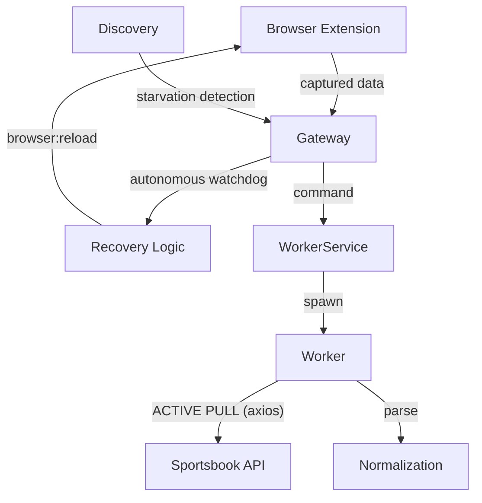
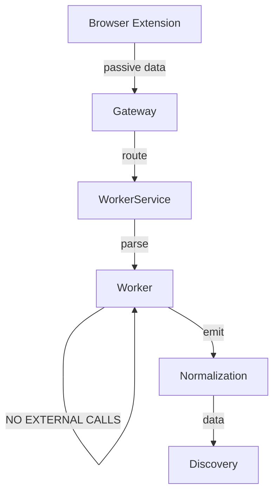

# 🔍 Architecture Audit v3.1 (Desktop Rebuild)

## 🗺️ 1. Flow Map Aktual vs Target

### Aktual (Violating v3.1)

### Target v3.1 (Strict Compliance)

## 📋 2. File Role Table

| File | Fungsi Sebenarnya | Role | Compliant v3.1 |
| :--- | :--- | :--- | :--- |
| `gateway.module.ts` | WebSocket & Health Watchdog | Actor/Processor | **TIDAK** (Has watchdog) |
| `workers/worker.service.ts` | Worker Orchestrator | Actor/Processor | **TIDAK** (Restarts workers) |
| `workers/api-worker.ts` | Passive & Active Ingestion | Actor/Processor | **TIDAK** (Active pullers) |
| `recovery/provider.recovery.ts` | Auto-heal logic | ACTOR | **TIDAK** (HARD BAN) |
| `discovery/discovery.service.ts` | Match registry | Processor | **TIDAK** (Has system-halt logic) |
| `workers/browser.automation.ts` | OS Browser Open | Actor | **YA** (User Triggered) |
| `workers/contract-registry.ts` | Session Storage | Processor | **TIDAK** (Complex token logic) |

## 🧨 3. DELETE LIST FINAL

Daftar modul/fungsi yang harus DIHAPUS SEGERA:

1.  **Entire Directory**: `src/recovery/` (Auto-heal & recovery logic).
2.  **Worker Logic**: `api-worker.ts` -> Seluruh method `pullMatches`, `pullOdds`, `pullBalance`, `autoProbing`.
3.  **Gateway Watchdog**: `gateway.module.ts` -> `onModuleInit` health watchdog (setInterval).
4.  **Discovery Watchdog**: `discovery.service.ts` -> `SYSTEM-HALT` timer & metric reports.
5.  **Execution Logic**: `arbitrage/execution/` (Jika ada active order execution).
